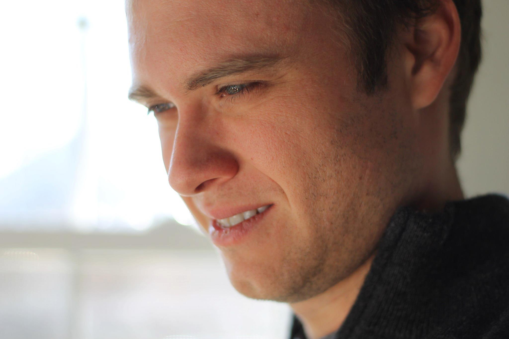
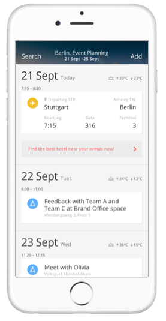

### Robert F. Dickerson 
Advisory Software Engineer
IBM Mobile Innovation Lab

[@rfdickerson](https://twitter.com/rfdickerson)

Before joining IBM, I was on the Computer Science faculty at the [College of William and Mary](http://www.cs.wm.edu) and then at the [University of Texas at Austin](http://www.cs.utexas.edu). I was able to teach courses that I was strongest in which are Data Structures, Computer Architecture, and Mobile Computing. Although, I found teaching to be extremely intellectually challenging and fun, I became more interested in taking a career that gave me the ability to exercise my creative interests and gave me the chance to code and create new systems.

What really drew me to working at IBM was the amount of interest and investment in Mobile, IoT, and Cognitive computing, and knew that I wanted to be a part of the changes that were happening here at IBM.

Since joining the IBM Mobile Innovation Lab in July 2015, I have been given all sorts of opportunities and  responsibilities. My first job was being the ScrumMaster and tech lead on a music festival recommendation App called "Chorus" that uses your Spotify profile to recommend a plan for seeing music artists that match your musical taste. The interesting thing about this project was that I got to learn how to build collaborative filtering algorithms and deploy them on Bluemix.

Next, I was again a ScrumMaster but this time for the Mobile Innovation Lab's 7th Ready App for Travel and Transportation. This app helps a user plan a trip in another city, make recommendations on points of interests and also figure out transportation from one place to the next. For instance, it can figure out alternate plans if there is bad weather coming, recommending a different meeting place if that's the case. This app was much bigger in scale with 2 designers, a product manager, and 6 developers. The neat thing about this App was learning about all sorts of technologies and figuring how was to integrate them all. We used Liberty, Cloudant, Business Rules, Tradeoff Analytics, and Personality Insights in order to build a responsive and personalized travel and transportation recommendation application. We have [open sourced our code](https://github.com/IBM-MIL/IBM-Ready-App-for-Travel) on GitHub.

I am really excited to be working on the Watson iOS SDK, since I know that all sorts of developers, from startups to hackathon participants will want to quickly have access to the Watson services in their projects. My focus of this work has been on the Speech services, since I can see so many applications using these services in the mobile environment. Right now, almost all of Watson's algorithms run on the Cloud, however there is a lot of potential to have some of that work such as speech recognition, computer vision, and gesture recognition offloaded to the mobile devices. As devices get more powerful, and needs for saving energy, there are compelling reasons to move computation on to devices. I am excited to be a part of this.

Before teaching, I received my PhD in Computer Science from the [University of Virginia](http://www.cs.virginia.edu/) on works combining machine learning with sensor networks. Some of my publications can be viewed at my author's page at the [ACM Digital Library](http://dl.acm.org/author_page.cfm?id=81320489054&CFID=735561193&CFTOKEN=83738004)

When I am not at work, absolutely love to swing dance (Balboa, Lindy Hop, and the Charleston). I started dancing close to 15 years ago. In that time, I have helped found a dance studio, have taught thousands of people to dance, and I travel all over the US to go to workshops and dance exchanges to learn, meet people, and also compete. If you live in Austin, you can check out our scene at the [Austin Swing Syndicate](http://www.austinswingsyndicate.org/home/).
