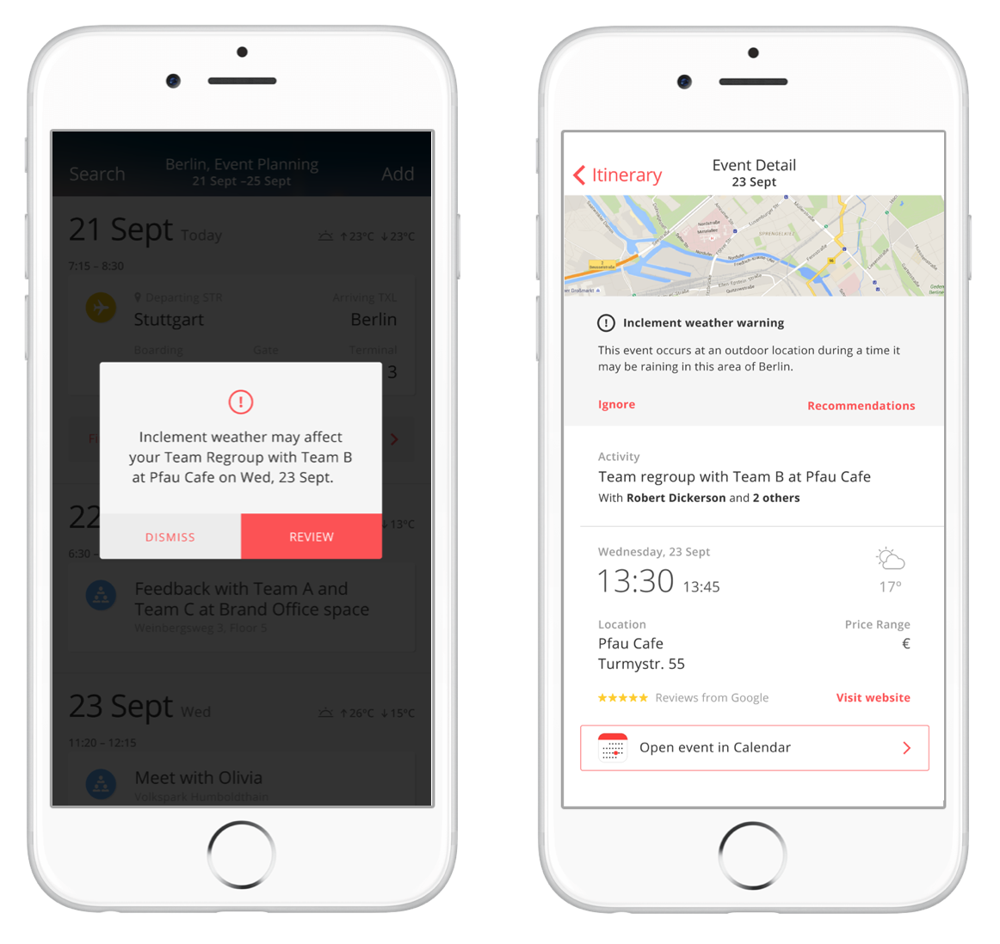
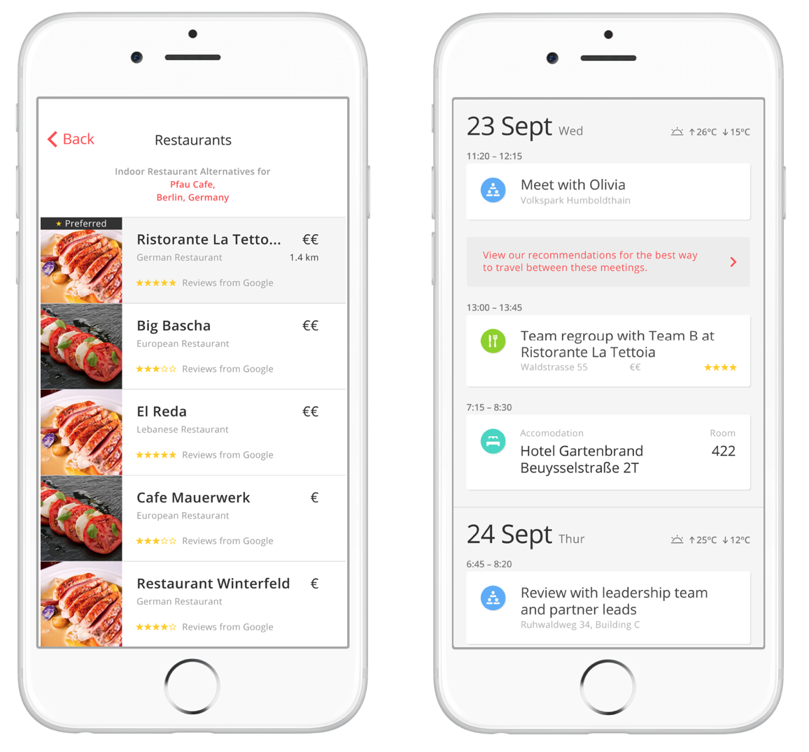
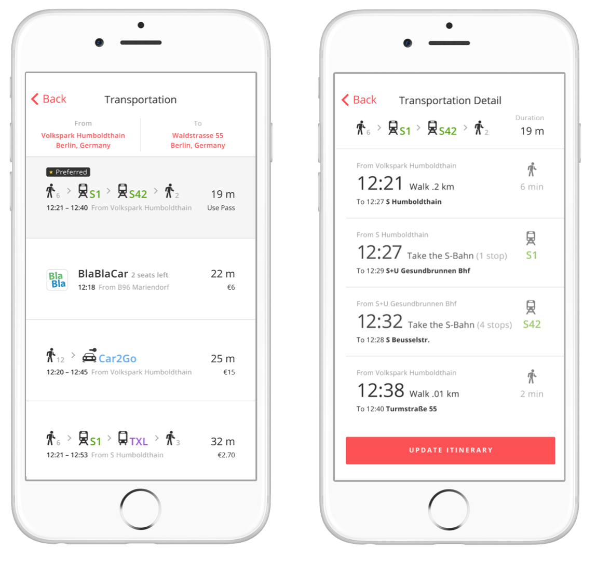

# Building a Recommendation Engine for Travel and Transportation

Glenn R. Fisher and Robert F. Dickerson

We designed the IBM Ready App 7 Travel and Transportation app to address the likely frustrations that many travelers experience when visiting a new city:
"How should I get from this meeting to the next?" Which hotel should I stay in each night?", "What nearby attractions can I see while I spend these two hours between my meeting?", "Now that there are thunderstorms, where should I go instead?".

We tell our story through a user called Lara, who is an event planner from Stuttgart who is visiting Berlin and doing a series of business meetings with locals to prepare for an event she is planning in a couple of months. 


## Dynamically responding to inclement weather

Before Lara began her trip to Berlin, she had arranged a series of meetings with her team. One of the meetings what scheduled for Pfau Cafe, which is a scenic beer garden outdoors, however does not have an indoor area. The morning of her meeting, she discovers that a thunderstorm is heading towards Berlin. We want to alert Lara that her important team meeting could be affected by this change of weather and to give her additional options for another place to meet. 



When a traveler adds an event to her itinerary, the Travel and Transportation app registers for weather updates in that region. We used the [Weather Underground API](http://www.wunderground.com/weather/api/) for getting us real-time data about the weather patterns at the time that the event occurs. Unfortunately, Yelp and Google Places API does not provide information about whether a venue is outdoors or indoors, so we had to augment this information in order for this example to work. We built our system to recognize certain rules such as if thunderstorms are happening during the time of the event, flag events that are outdoors like going on a hike in the country. We have considered additional rules such as during snowy conditions, recommend not traveling by car but recommend skiing for example.

## Recommending Points of Interest

When Lara is alerted about an inclement weather warning at Pfau Cafe, out app prepares an alternative meeting location. Out app produces a smart recommendation that matches our user's personality to the personalities of those whom frequent a venue. The aspects of personality we chose were Outgoingness, Intellect, Adventurousness, and Risk-taking, since these features seemed to be most applicable to to point of interest.  

For seeding a user's personality, we used the words in Lara's profile using the [LinkedIn API](https://developer.linkedin.com/). We could extend this to alternatively use words from the user on Twitter, Facebook, or other social media for getting some data about the traveler's personality. This input was given to [Watson's Personality Insights](http://www.ibm.com/smarterplanet/us/en/ibmwatson/developercloud/personality-insights.html) API to form a personality profile for the user. The "Big Five" personality traits in the model are Agreeableness, Conscientiousness, Extraversion, Emotional Range, Openness. However, under each top-level dimension there are six subdimensions. An example of the personality profile is shown below: 


We selected Outgoingness, Intellect, Adventurousness, and Risk-taking for creating our feature vector since those features seemed most relevant for recommended points of interests. The personality vector ***t*** is then formed.

$$ \textbf{t} = [0.44, 0.96, 0.90, 0.03]^T $$

Next, we form a personality profile for a point of interest (POI). We aggregated the reviews for a given point of interest using [Yelp's API](https://www.yelp.com/developers/documentation/v2/search_api). Each of these POIs, then have their own respective personality vector. 

The evaluate a match, we operate of the assumption that there is a distance between the user's personality vector ***t*** and the point of interest's personality vector **p** Therefore, the distance between the traveler's personality and the reviews for the point of interest is simply the norm:

$$ \|| \mathbf{p} - \mathbf{t} \|| $$


```javascript

function distance(a, b) {
// code here
}

```

We then use k-nearest neighbors (kNN) approach in order to cluster similar points of interest into similar categories. For all of these distances, we sort them in ascending order. Therefore, for matching a particular user to a POI operates in O(n log n) time. 

```
code for kNN here

```

(show interactive visualization of the clusters)

We finally show the sorted list of recommendations to the user:



Lara in this case has chosen Ristorante La Tettoia. This is where our app automatically provides recommendations for travel options that will get her from Volkspark Humboltthain to Walderstrasse in time to make her next meeting.

## Recommending Transportation options

Our database contains a list of possible routes, for each we consider the duration of trip, number of legs, price, preferred departure time, and proximity to current location. We used the [Watson Tradeoff Analytics API](http://www.ibm.com/smarterplanet/us/en/ibmwatson/developercloud/tradeoff-analytics.html) in order to find the most optimized combination of these factors.

Tradeoff analytics uses a Pareto optimal tradeoff engine to help select the best option. 

- All of the dominant option's values are at least as good as the other option's values.
- At least one of the dominant option's values is strictly better than the corresponding value of the other option.





## References

- [Science behind the Tradeoff analytics service](http://www.ibm.com/smarterplanet/us/en/ibmwatson/developercloud/doc/tradeoff-analytics/science.shtml)
- [k-Nearest Neighbor algorithm](https://en.wikipedia.org/wiki/K-nearest_neighbors_algorithm)
