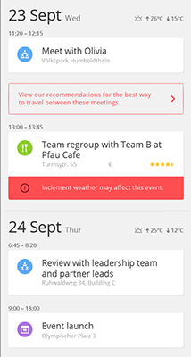
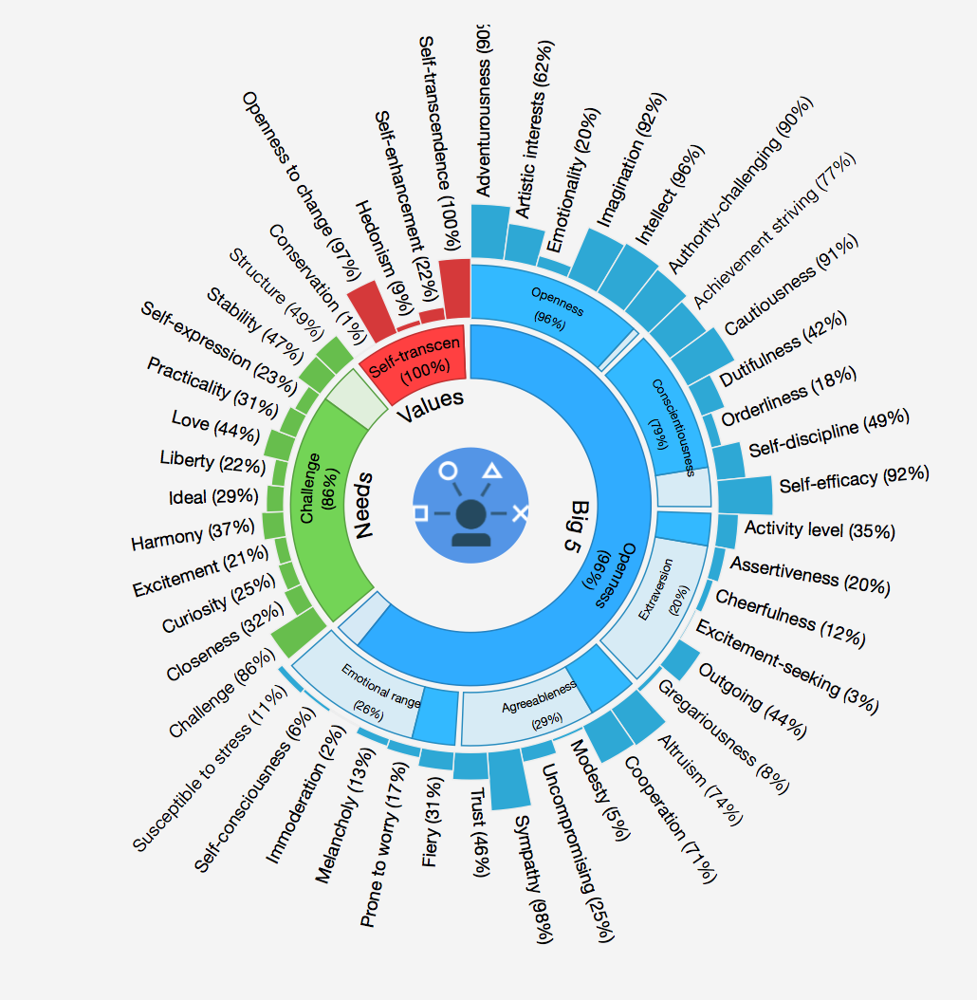

# Building a Recommendation Engine for Travel and Transportation

Glenn R. Fisher and Robert F. Dickerson

When building the IBM Ready App 7 Travel and Transportation app, we wanted to address the likely frustrations that many travelers experience when visiting a new city:
"How should I get from this meeting to the next?" Which hotel should I stay in each night?", "What nearby attractions can I see while I spend these two hours between my meeting?", "Now that there are thunderstorms, where should I go instead?".

We tell our story through a user called Lara, who is an event planner from Britain who is visiting Berlin and doing a series of business meetings. We designed the app to synchronize the existing events in the user's calendar. However, the result are many gaps in the schedule, missing transportation options. 


## Recognizing inclement weather

The first point of the story is that during Lara's travels she has planned a meeting at a Cafe that's outdoors without a suitable indoors area. However, during this time, a thunderstorm is heading towards Berlin. We want to alert Lara that her important team meeting could be affected by this change of weather and to give her additional options for another place to meet. 



When a traveler adds an event to their itinerary, the Travel and Transportation app registers for weather updates in that geography. We used the [Weather Underground API](http://www.wunderground.com/weather/api/) for getting us real-time data about the weather patterns at the time that the event occurs. Unfortunately, Yelp and Google Places API does not provide information about whether a venue is outdoors or indoors, so we had to augment this information manually in order for this example to work. We built our system to recognize certain rules such as if thunderstorms are happening during the time of the event, flag events that are outdoors like going on a hike in the country. We have considered additional rules such as during snowy conditions, recommend not traveling by car but recommend skiing for example.

## Recommending Points of Interest

When Lara is alerted about an inclement weather warning at Pfau Cafe, we wanted to not only recommend another destination that was indoors, but also a destination that was most likely to have people who are most similar to her. We decided to use personality in particular Outgoingness, Intellect, Adventurousness, and Risk-taking as features that we would be able to match a traveller to a point of interest.  

First, we use Lara's [LinkedIn](https://developer.linkedin.com/) profile and the words used in the profile to create input data for [Watson Personality Insights](http://www.ibm.com/smarterplanet/us/en/ibmwatson/developercloud/personality-insights.html). We could also use words written by the user on Twitter, Facebook, or other social media for getting some data about the traveler's personality. Personality Insights works best if you can supply over 3500 words as input. The result is a psychological inventory for the user. The "Big Five" personality traits in the model are Agreeableness, Conscientiousness, Extraversion, Emotional Range, Openness. However, under each top-level dimension there are six subdimensions. 




We selected Outgoingness, Intellect, Adventurousness, and Risk-taking for creating our feature vector since those features seemed most relevant for recommended points of interests. 

$$ \textbf{t} = [0.44, 0.96, 0.90, 0.03]^T $$

Each point of interest is also evaluated based on the aggregate reviews for that point of interest from [Yelp's API](https://www.yelp.com/developers/documentation/v2/search_api). Each user, therefore has a distance between their feature vector and the point of interest's feature vector **p** Therefore, the distance between the traveler's personality and the reviews for the point of interest is:

$$ \|| \mathbf{p} - \mathbf{t} \|| $$


We then use k-nearest neighbors (kNN) approach in order to cluster similar points of interest into similar categories. 

```
code for kNN here

```

visualization of the clusters

## Recommending Transportation options

